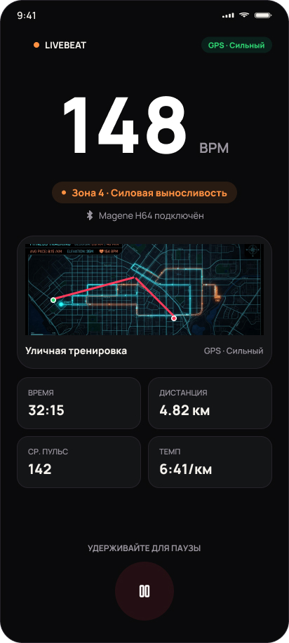
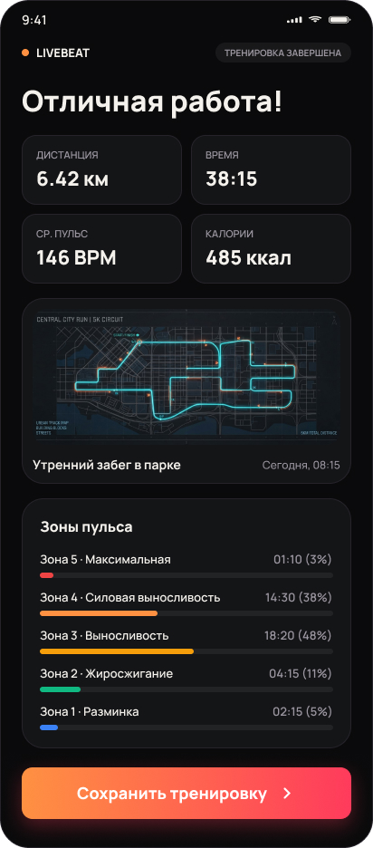
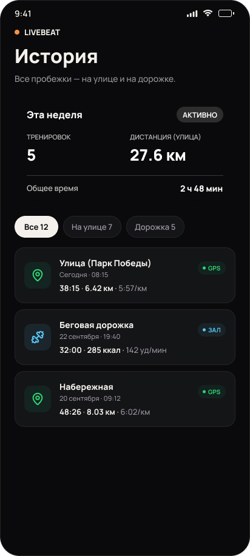
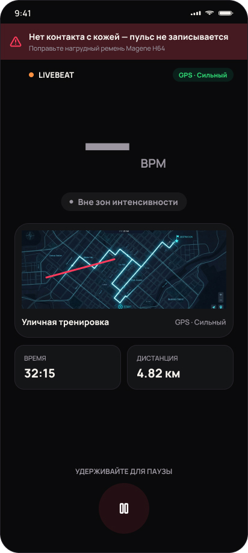
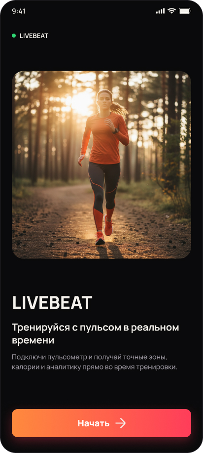
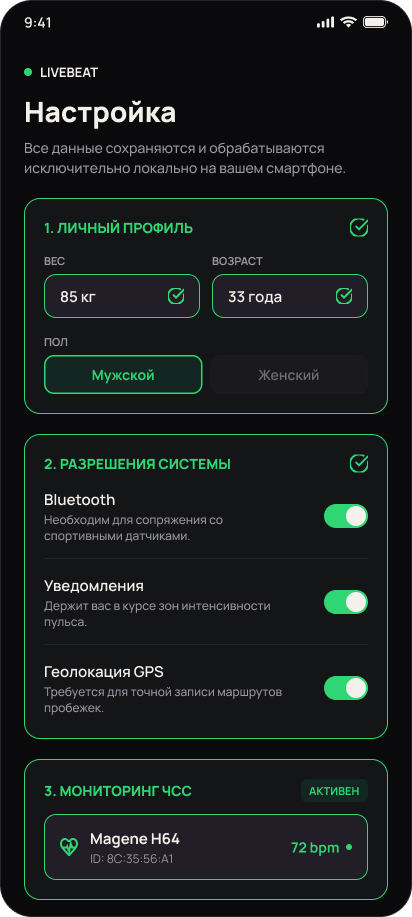
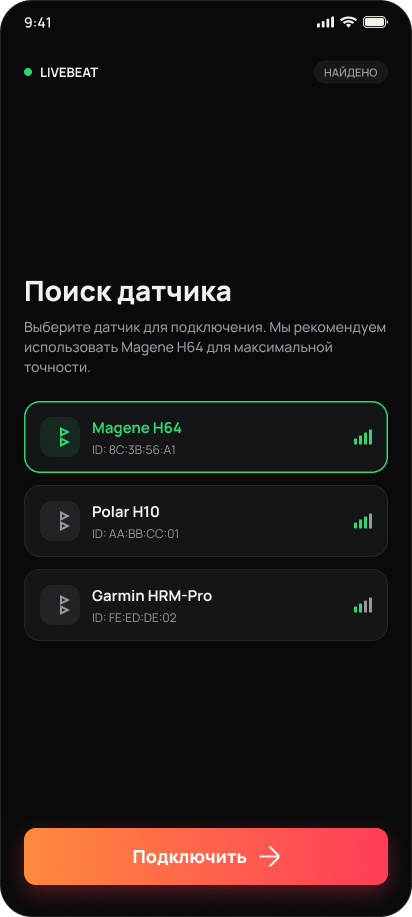
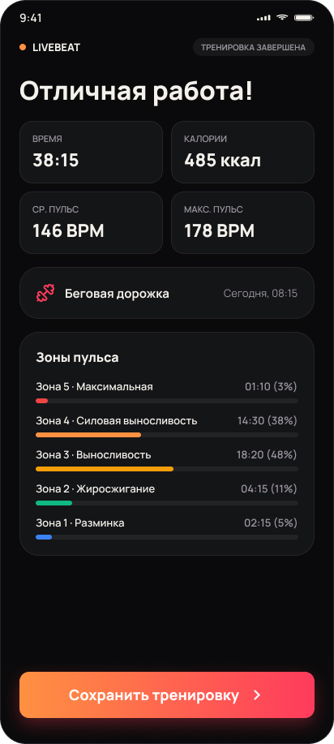

# LiveBeat

**Тренировки с пульсом в реальном времени.** Android-приложение, которое подключается к
нагрудному пульсометру по Bluetooth, показывает зону нагрузки во время тренировки, пишет
GPS-трек и после финиша раскладывает тренировку по зонам. Без аккаунтов, без облака,
бесплатно: всё хранится на телефоне.

<table>
  <tr>
    <td align="center"><br><sub>Пульс крупно, зона цветом, трек на карте</sub></td>
    <td align="center"><br><sub>Итоги: маршрут и время в пяти зонах</sub></td>
    <td align="center"><br><sub>История и сводка за неделю</sub></td>
    <td align="center"><br><sub>Ремень сполз: пульс не пишется, об этом прямо сказано</sub></td>
  </tr>
  <tr>
    <td align="center"><br><sub>Первый запуск: одна кнопка вместо регистрации</sub></td>
    <td align="center"><br><sub>Профиль, разрешения и датчик на одном экране</sub></td>
    <td align="center"><br><sub>Поиск пульсометра по Bluetooth LE</sub></td>
    <td align="center"><br><sub>Дорожка: без GPS, только то, что честно даёт пульс</sub></td>
  </tr>
</table>

<sub>Скриншоты — макеты из Figma, по которым сделан интерфейс. В приложении часть экранов
уже ушла дальше: выбор из семи видов тренировок, статусы разрешений вместо переключателей,
карта OpenStreetMap вместо иллюстрации.</sub>

## Зачем

Часы и браслеты меряют пульс запястьем и на бегу ошибаются. Нагрудный ремень точнее, но
без приложения это просто цифра. LiveBeat превращает её в тренировку по пульсу: видно, в
какой зоне ты сейчас, телефон вибрирует и говорит, если вышел из целевой, а после финиша
понятно, как на самом деле прошла нагрузка.

Проект личный: я сделал его для своих пробежек с Magene H64 и раздаю бесплатно, из
принципа. Данные о здоровье не уходят с телефона: нет ни аккаунтов, ни аналитики, ни
серверов. В сеть приложение ходит только за тайлами карты.

## Что умеет

**На тренировке**
- Пульс в реальном времени и пять зон ЧСС (от максимального пульса по возрасту и полу).
- Семь видов: улица (бег и ходьба с GPS), дорожка, велосипед (скорость вместо темпа), зал
  с таймером отдыха, кроссфит с интервальным таймером (Tabata, EMOM, AMRAP, свои, шаблоны),
  йога, прочее.
- Целевая зона: вибрация и голос, когда пульс из неё вышел.
- Голосовые подсказки в наушники: каждый километр темп и пульс, без GPS каждые N минут.
  Работают с заблокированным экраном.
- Живой трек на карте и загруженный маршрут GPX пунктиром.
- Пауза удержанием кнопки: мокрым пальцем тренировку случайно не завершить.

**После**
- Итоги: время в каждой зоне, сплиты по километрам (без ручных пауз), пульс
  восстановления за минуту после остановки, у йоги спад пульса к концу практики.
- История с фильтрами по видам, цели на неделю, статистика за 7 и 30 дней.
- Прогресс: как меняется пульс на одном и том же темпе, динамика по неделям, личные
  рекорды отдельно для бега и велосипеда.
- Экспорт трека в GPX (для Strava и подобных), выгрузка и загрузка всей истории одним
  файлом, виджет «Эта неделя» на рабочий стол.

## Что сделано для надёжности

Самое сложное здесь не экраны, а то, чтобы запись не рвалась на бегу.

- **Соединение с датчиком** держит отдельная машина состояний: один коннект за раз,
  повторы с паузами, а если ремень пропал из эфира, приложение сначала слушает эфир и
  подключается, только когда он вернулся. Покрыта тестами на поддельном Bluetooth,
  который ведёт себя как настоящий, включая долгие таймауты.
- **Контакт с кожей.** Снятый ремень ещё минуту шлёт последнее значение, как будто всё в
  порядке. Приложение это распознаёт и не пишет застывший пульс в статистику.
- **Тренировка переживает выгрузку приложения.** Android на энергосбережении может убить
  процесс посреди пробежки. Идущая тренировка раз в ~10 секунд (и сразу при уходе в фон)
  сохраняется черновиком и при следующем запуске продолжается с того же места, вместе с
  паузами и интервальным таймером.
- **Фон.** Пока идёт тренировка, процесс держит foreground-сервис с уведомлением, GPS пишет
  свой, так что запись идёт и с заблокированным экраном в кармане.

## Чего здесь нет, и это осознанно

- **ВСР (вариабельность пульса).** Её пробовали считать и убрали: тестовый ремень доносит до
  телефона только треть ударов, и цифра выходила недостоверной. Лучше не показывать ничего,
  чем показывать неправду о здоровье.
- **Суточный мониторинг и сон.** Нагрудный ремень не носят сутками, а фоновая запись тянула
  за собой почти все проблемы с надёжностью.
- **iOS.** Только Android.

## Датчики

Проверено на **Magene H64**. Приложение работает по стандартному Bluetooth-профилю Heart
Rate (`0x180D`), поэтому должно подходить к любому нагрудному пульсометру с ним (Polar,
Garmin, Wahoo и другие), но на них не проверялось.

## Стек

Expo SDK 57 · React Native 0.86 · TypeScript · Zustand · SQLite (`expo-sqlite`) ·
`react-native-ble-plx` · MapLibre + OpenFreeMap (без Google-сервисов и ключей) · Notifee ·
`expo-speech` · Jest.

Логика, от которой зависят цифры (разбор пакетов пульса, детектор контакта, зоны,
калории, сплиты, таймеры, восстановление, формат файла истории), вынесена в модули без
React Native и покрыта юнит-тестами.

## Сборка

```bash
npm ci
npx tsc --noEmit
npx jest
```

APK собирает GitHub Actions на каждый пуш в `master` (`.github/workflows/build-android.yml`):
тесты, затем standalone-сборка под arm64. Готовый APK лежит в артефактах прогона на
вкладке Actions. Для разработки есть dev-client: `npx expo start --dev-client`.

Для BLE, GPS и фоновой работы нужен реальный телефон и датчик, эмулятор не подойдёт.

## Документация

Подробный разбор архитектуры, решений и планов лежит в [`plans/`](plans/README.md):
почему соединение с датчиком устроено именно так, что не так с RR-интервалами на H64, как
устроена сборка и подпись APK, и что делается дальше ([`plans/roadmap.md`](plans/roadmap.md)).

## Статус

Рабочий прототип для личного использования: на нём проверяются идеи и железо, прежде чем
переписать приложение начисто.
